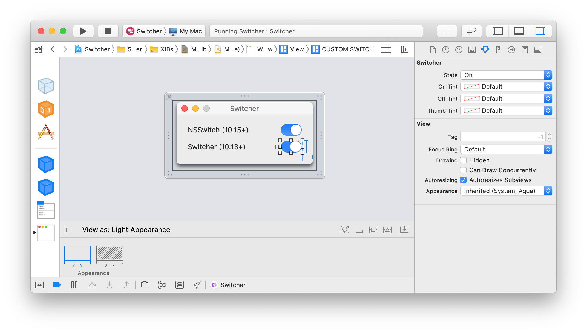
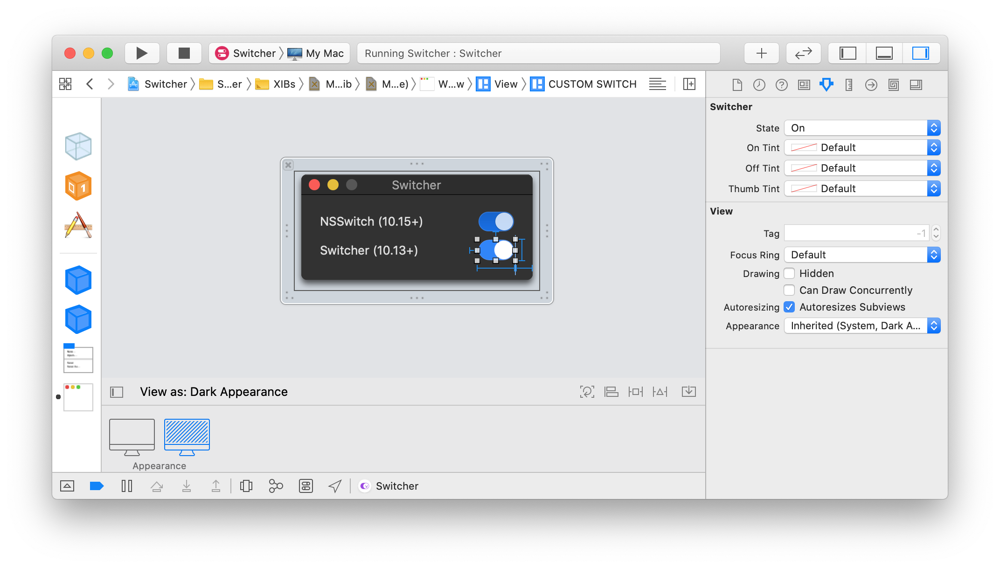

# Switcher for macOS 

---

Switcher is intended to be the simplest way to add the **"Switch"** control for macOS app, supporting older versions like `macOS 10.13` or `macOS 10.14`

## Why?

Just because its fun, and also because apple introduced the [NSSwitch](https://developer.apple.com/documentation/appkit/nsswitch) but it's only supported for `macOS 10.15+`

## Features?

Again just for fun, I used things like `@IBInspectable` and `@IBDesignable`, which is way cool 😎 because with that we can define a way to set `state`, `onTint`, `offTint` directly via **StoryBoard/Xib** and the most awesome thing is we can see a live preview instantly 🤓.

###  Switcher preview in light mode

---

###  Switcher preview in dark mode

---

###  Switcher preview in dark mode with some custom tint colors

---

## Improvements?

1. Switch state transitions could be animated
1. ???
